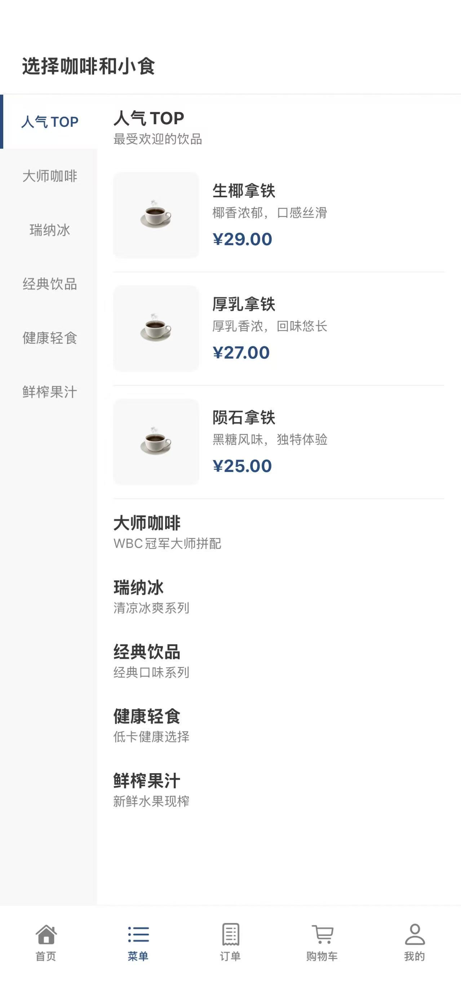
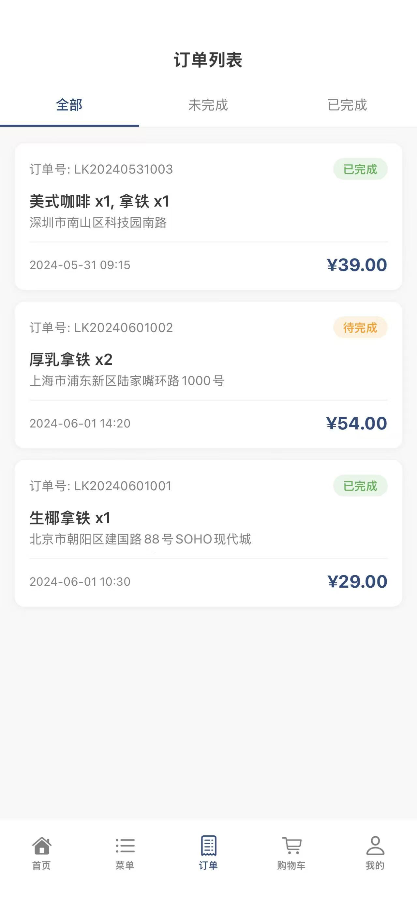
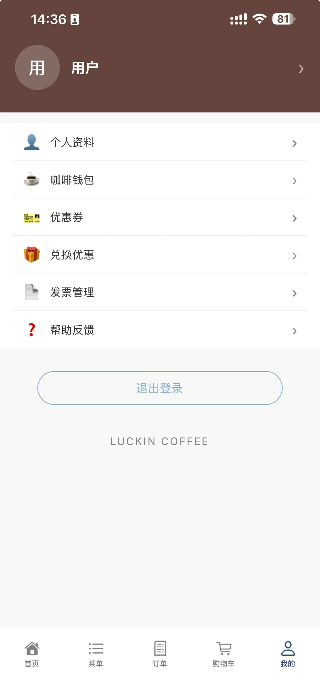
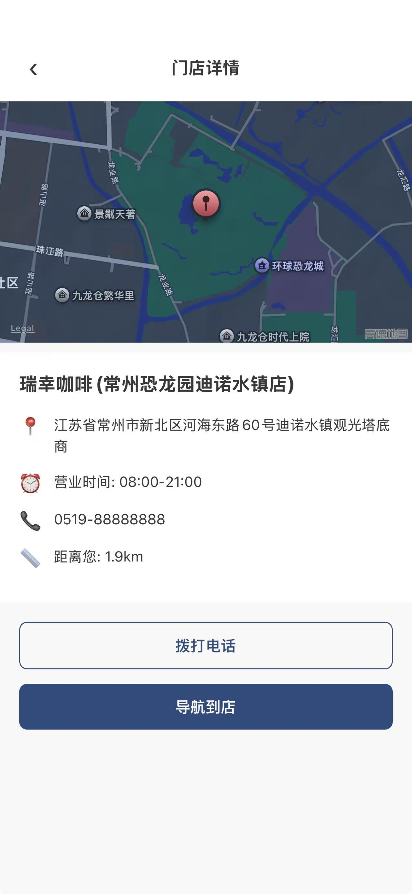

# 瑞幸咖啡 - React Native 应用

基于 Flutter 瑞幸咖啡应用重写的 React Native (Expo) 版本，实现了完整的咖啡点单功能。

## 项目简介

这是一个使用 Expo + React Native + TypeScript 开发的咖啡点单应用，仿照瑞幸咖啡 App 的 UI 和功能。项目从 Flutter 版本完整迁移，并实现了 Flutter 中未完成的功能。

## 功能特性

### 核心功能
- **首页** - 轮播 Banner、快捷入口、门店信息
- **菜单** - 左右联动滚动分类、商品列表、商品详情弹窗
- **购物车** - 商品增删改查、数量调整、价格计算（Flutter 中未实现）
- **订单** - 订单列表（Tab 筛选）、确认订单、订单详情、订单评价、订单备注
- **我的** - 用户信息、功能菜单、退出登录

### 用户系统
- 邮箱注册/登录
- Token 认证
- 个人资料展示

### 门店功能
- 门店列表展示
- 门店详情（营业时间、地址、电话）
- 自提/外送切换

### 其他功能
- 优惠券领取和保存
- 取餐码随机生成（带倒计时）
- 用户协议页面

## 应用截图

| 首页 | 菜单 | 购物车 |
|------|------|--------|
|  |  |  |

| 订单 | 我的 | 门店详情 |
|------|------|----------|
|  |  |  |

> 请将截图文件放入 `assets/screenshots/` 文件夹

## 技术栈

### 前端 (Expo)
- **框架**: Expo SDK 54 + React Native
- **路由**: Expo Router 6 (文件路由)
- **状态管理**: Zustand
- **语言**: TypeScript
- **本地存储**: AsyncStorage (Web) / localStorage (Web)

### 后端 (Node.js)
- **运行时**: Node.js
- **框架**: Express.js
- **数据库**: MySQL (TiDB Cloud)
- **认证**: JWT (JSON Web Token)
- **密码加密**: bcryptjs

## 项目结构

```
rn_lucky_tea/
├── app/                          # 页面路由 (Expo Router)
│   ├── (tabs)/                   # 底部标签页
│   │   ├── index.tsx            # 首页
│   │   ├── menu.tsx             # 菜单页
│   │   ├── order.tsx            # 订单页
│   │   ├── cart.tsx             # 购物车页
│   │   ├── mine.tsx             # 我的页面
│   │   └── _layout.tsx          # 标签页布局
│   ├── login/                   # 登录相关
│   │   ├── index.tsx            # 登录方式选择
│   │   └── mail.tsx             # 邮箱登录/注册
│   ├── order/                   # 订单相关
│   │   ├── confirm.tsx          # 确认订单
│   │   ├── detail.tsx           # 订单详情
│   │   ├── evaluate.tsx         # 订单评价
│   │   └── remark.tsx           # 订单备注
│   ├── store/                   # 门店相关
│   │   ├── index.tsx            # 门店列表
│   │   └── detail.tsx           # 门店详情
│   ├── agreement.tsx            # 用户协议
│   ├── coupon.tsx               # 优惠券页面
│   ├── dining-code.tsx          # 取餐码页面
│   └── _layout.tsx              # 根布局
├── components/                  # 组件
│   ├── ui/                      # 基础 UI 组件
│   │   ├── Button.tsx           # 按钮组件
│   │   ├── Row.tsx              # 行布局组件
│   │   ├── Stepper.tsx          # 步进器组件
│   │   ├── Swiper.tsx           # 轮播图组件
│   │   └── SelectRow.tsx        # 选项行组件
│   ├── AddressRow.tsx           # 地址行组件
│   ├── CartRow.tsx              # 购物车商品行
│   ├── CouponCard.tsx           # 优惠券卡片
│   ├── GoodsDetailModal.tsx     # 商品详情弹窗
│   ├── OrderListRow.tsx         # 订单列表行
│   ├── RecommendGoods.tsx       # 推荐商品卡片
│   └── TakeOutToggle.tsx        # 自提/外送切换
├── constants/                   # 常量
│   └── colors.ts                # 颜色常量
├── services/                    # API 服务
│   ├── api-client.ts            # API 客户端
│   ├── auth-service.ts          # 认证服务
│   ├── goods-service.ts         # 商品服务
│   ├── order-service.ts         # 订单服务
│   └── coupon-service.ts        # 优惠券服务
├── stores/                      # 状态管理
│   ├── auth-store.ts            # 认证状态
│   ├── goods-store.ts           # 商品状态
│   ├── cart-store.ts            # 购物车状态
│   ├── order-store.ts           # 订单状态
│   └── coupon-store.ts          # 优惠券状态
├── types/                       # 类型定义
│   └── index.ts                 # TypeScript 类型
├── utils/                       # 工具函数
│   └── storage.ts               # 存储工具
├── assets/                      # 静态资源
├── app.json                     # Expo 配置
├── package.json                 # 依赖配置
└── tsconfig.json                # TypeScript 配置
```

## 快速开始

### 前置要求

- Node.js >= 18
- npm 或 yarn
- Expo Go App (手机测试)
- 后端服务器 (见 server 目录)

### 安装步骤

1. **克隆项目**
   ```bash
   git clone https://github.com/hlw422/rn_lucky_tea.git
   cd rn_lucky_tea
   ```

2. **安装依赖**
   ```bash
   npm install
   ```

3. **启动后端服务器**
   ```bash
   # 进入后端目录
   cd ../flutter_luckin_coffee/server
   
   # 复制配置文件
   cp .env.example .env
   
   # 编辑 .env 文件，填入你的数据库配置
   # vim .env
   
   # 安装依赖
   npm install
   
   # 启动服务器
   npm start
   ```

4. **启动 Expo 应用**
   ```bash
   # 返回项目目录
   cd ../../rn_lucky_tea
   
   # 启动开发服务器
   npm start
   ```

5. **运行应用**
   - **Web**: 按 `w` 键在浏览器中打开
   - **Android**: 按 `a` 键在 Android 模拟器中打开
   - **iOS**: 按 `i` 键在 iOS 模拟器中打开
   - **手机**: 使用 Expo Go 扫描二维码

### 手机端配置

手机端需要使用电脑的局域网 IP 地址访问后端：

1. 修改 `services/api-client.ts` 中的 `BASE_URL`
2. 将 `localhost` 替换为你的电脑 IP（如 `192.168.1.121`）

```typescript
const BASE_URL = Platform.OS === 'web' 
  ? 'http://localhost:4001/api' 
  : 'http://192.168.1.121:4001/api';
```

## API 文档

### 基础信息
- Base URL: `http://localhost:4001/api`
- Content-Type: `application/json`

### 公开接口

#### 用户注册
```http
POST /api/register
Body: { "email": "user@example.com", "password": "123456", "name": "用户名" }
Response: { "code": 0, "data": { "token": "...", "user": { "id": 1, "email": "...", "name": "..." } } }
```

#### 用户登录
```http
POST /api/login
Body: { "email": "user@example.com", "password": "123456" }
Response: { "code": 0, "data": { "token": "...", "user": { "id": 1, "email": "...", "name": "..." } } }
```

#### 获取商品分类
```http
GET /api/categories
Response: { "code": 0, "data": [{ "id": 1, "name": "人气TOP", "desc": "最受欢迎的饮品" }] }
```

#### 获取商品列表
```http
GET /api/goods?categoryId=1
Response: { "code": 0, "data": [{ "id": 1, "categoryId": 1, "name": "...", "originalPrice": 25.00, "pic": "..." }] }
```

### 需要认证的接口

请求头需要添加：
```
Authorization: Bearer <token>
```

#### 获取订单列表
```http
GET /api/orders?status=pending
Response: { "code": 0, "data": [{ "id": 1, "orderNum": "...", "price": 25.00, "status": "pending" }] }
```

#### 获取优惠券
```http
GET /api/coupons
Response: { "code": 0, "data": [{ "id": 1, "discount": 5, "name": "...", "expireDate": "2024-12-31" }] }
```

## 数据库结构

### users 表
| 字段 | 类型 | 说明 |
|------|------|------|
| id | INT | 主键 |
| email | VARCHAR | 邮箱（唯一） |
| password | VARCHAR | 加密密码 |
| name | VARCHAR | 用户名 |
| avatar | VARCHAR | 头像 |

### categories 表
| 字段 | 类型 | 说明 |
|------|------|------|
| id | INT | 主键 |
| name | VARCHAR | 分类名称 |
| description | VARCHAR | 分类描述 |

### goods 表
| 字段 | 类型 | 说明 |
|------|------|------|
| id | INT | 主键 |
| category_id | INT | 分类 ID |
| name | VARCHAR | 商品名称 |
| characteristic | VARCHAR | 商品特色 |
| original_price | DECIMAL | 原价 |
| pic | VARCHAR | 商品图片 |

### orders 表
| 字段 | 类型 | 说明 |
|------|------|------|
| id | INT | 主键 |
| user_id | INT | 用户 ID |
| order_num | VARCHAR | 订单号 |
| address | VARCHAR | 地址 |
| goods_name | VARCHAR | 商品名称 |
| price | DECIMAL | 价格 |
| order_time | DATETIME | 下单时间 |
| status | VARCHAR | 状态 |

### coupons 表
| 字段 | 类型 | 说明 |
|------|------|------|
| id | INT | 主键 |
| user_id | INT | 用户 ID |
| discount | DECIMAL | 折扣金额 |
| name | VARCHAR | 优惠券名称 |
| category | VARCHAR | 适用分类 |
| expire_date | DATE | 过期日期 |
| used | TINYINT | 是否已使用 |

## Flutter 中已实现的未完成功能

1. **购物车完整功能** - CartItem 模型 + cartStore + 增删改查
2. **加入购物车按钮** - GoodsDetailModal 中连接 cartStore
3. **订单详情真实数据** - 从路由参数获取订单信息
4. **确认订单真实价格** - 从购物车数据计算
5. **订单评价可提交** - 评分+评论功能
6. **优惠券保存功能** - AsyncStorage 本地保存
7. **门店页面真实数据** - 本地数据源展示
8. **取餐码随机生成** - 3位随机码+倒计时
9. **菜单联动滚动** - 左侧分类点击右侧滚动

## 开发说明

### 添加新页面

1. 在 `app/` 目录下创建新的 `.tsx` 文件
2. 文件名即为路由路径
3. 使用 `useRouter` 进行页面跳转

### 添加新组件

1. 在 `components/` 目录下创建 `.tsx` 文件
2. 使用 TypeScript 定义 Props 接口
3. 导出组件供页面使用

### 状态管理

使用 Zustand 进行状态管理：

```typescript
import { create } from 'zustand';

interface MyState {
  count: number;
  increment: () => void;
}

export const useMyStore = create<MyState>((set) => ({
  count: 0,
  increment: () => set((state) => ({ count: state.count + 1 })),
}));
```

### API 调用

使用统一的 API 客户端：

```typescript
import { apiClient } from '../services/api-client';

const data = await apiClient.get('/endpoint');
const result = await apiClient.post('/endpoint', { body });
```

## 常见问题

### Q: 手机端无法连接后端？
A: 确保手机和电脑在同一 WiFi 网络，并修改 `api-client.ts` 中的 IP 地址。

### Q: 数据库连接失败？
A: 检查 `.env` 文件中的数据库配置是否正确。

### Q: 如何添加新的商品分类？
A: 直接在数据库的 `categories` 表中插入新记录。

### Q: 如何部署到生产环境？
A: 
1. 构建 Expo 应用: `npx expo build`
2. 部署后端服务器到云服务器
3. 修改 API 地址为生产环境地址

## 相关项目

- [Flutter 版本](https://github.com/hlw422/flutter_luckin_coffee) - 原始 Flutter 实现
- [后端服务器](https://github.com/hlw422/flutter_luckin_coffee/tree/master/server) - Node.js 后端

## 许可证

MIT License

## 联系方式

- GitHub: [@hlw422](https://github.com/hlw422)
- 项目链接: https://github.com/hlw422/rn_lucky_tea

## 致谢

- [Expo](https://expo.dev/) - React Native 开发框架
- [Zustand](https://github.com/pmndrs/zustand) - 状态管理库
- [瑞幸咖啡](https://www.luckin.com/) - UI 设计灵感
